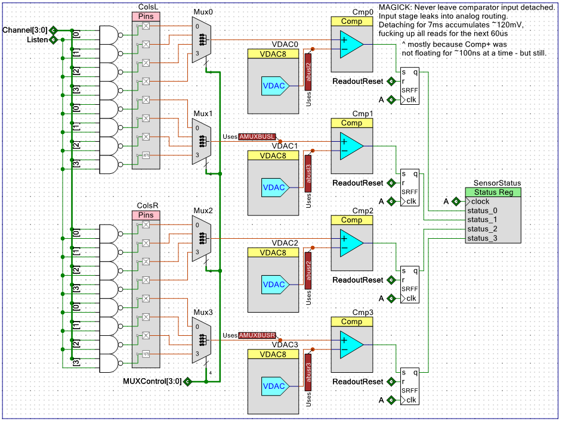
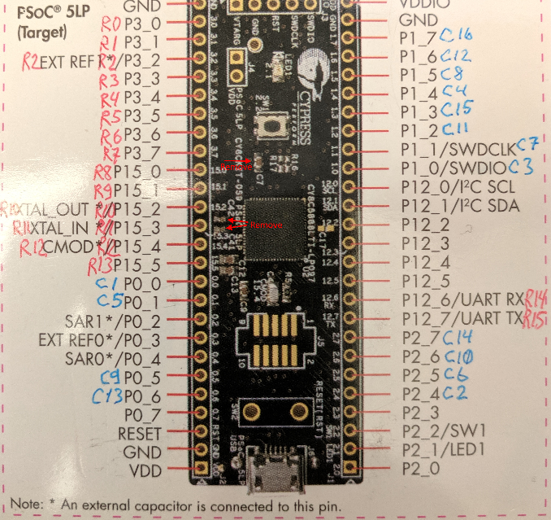

Remember that guy? Yeah. This is _that_ level of difficulty.

There's no matrix monitor - the programmable hardware is totally different and is, essentially, a 4-channel xwhatsit reimplementation, the only deviation being a separate DAC (hence threshold) per channel, each channel sitting behind a 4-channel multiplexor.

So it's back to blind tuning, and there's no autotune support xwhatsit util had. Partly because I'm a bit short on time recently, but largely because out of 3 test devices all 3 worked with same thesholds. I was able to literally solder a different keyboard to the same controller and it just worked with the thresholds from another - and to program a new controller, solder it to the third keyboard and just needing to correct for just a couple of keys, problem being "spacebar triggers if you press basically anything else".

Not much is known about what's _really_ going on inside the matrix, but I intend to get a bigger scope and figure this out in a couple of weeks while I still have access to the hardware.

# Before you begin
* This is optional, but highly valuable for troubleshooting: take high-res digital photos of both sides of your keyboard. High-res enough for traces to be 5px wide. Invaluable for tracing things.
  * Bonus points if you can fit all the board on one photo - stitching multiple photos is an ungrateful job.
  * Reference photos (too large to be inlined): [Cortron 35-500079](docs/MagValve/Cortron_35-500079_map.jpg), [Harris](docs/MagValve/Cortron_125-500451_map.jpg), [Nifco EKBB005A](docs/MagValve/Nifco_EKBB005A.jpg).
Black is ground, colors are rows/columns. They are messy, because it's not easy to find 20 different colors and I had to resort to patterns.
* Find row/column driver chips. They are relatively inconspicious: rows terminate at 74145(can be 2 of those) and columns - at 7442. Those are both BCD decoders, 7442 is stronger drive.
  * If your board has Mitsubishi chips - the conversion formula is M(53200+{74-series model})P:
    * 7416(74**0**16) is M53216P.
    * 7442 (74**0**42) is M53242P
    * 74145 is M53345P

# Prepping the board
## LED concerns
Some boards have LEDs with drivers that are active high. So far, 2 ways to drive those was discovered:
* [SN]7416, LEDs hanging from power rail
* 75452 with ganged outputs, driving LED directly.

If you want to use those - don't **ACCIDENTALLY** power the whole board.
Recommended way is to cut drivers' Vcc trace from the rest of the board and power them from controllers' VDD or VDDIO pins. This can be awfully inconvenient in case of LEDs hanging from power rail, in which case you might elect to power the whole board, but watch for USB power consumption - don't fry the USB port.
**WARNING: Don't power LEDs** (or anything else!) from GPIO pins. Not only it won't work, **you'll fry the GPIO**.

## Remove the drivers
Hot air is your weapon of choice, but solder wick or even dremel (From the top side!) work just as well - you won't need those anymore. Just try not to damage the pads.
## Find columns common point and ground it
If you see 10-ish diodes on the PCB, connected together on one side - congratulations, you found it. Diodes may be scattered around the PCB (as is in Harris case) - but then they all connect to a common bus.
**Cross-check:** those diodes are connected to 7442 via keyboard matrix.
Connect the diode cathodes (the band side), to the ground rail. Double check it's ground rail - just shorting diodes is not enough as their common point is NOT ground.

If you plan to use LEDs (see below), you may want to desolder diodes and connect the column traces to the ground directly.
## Find rows common point and ground it
Look for a swarm of jumper wires (or vias) between row traces, near 74145(s). Connect any of those vias to ground (
* Connect common point of rows (it's close to 74145(s), look for a swarm of jumper wires (or vias!) between tracks that go alongside the row traces) to the ground rail.
**PRO TIP:** pin 7 of 74145 is ground.

## Solder the interface wires
Find the place for the controller, trace, measure, cut, tin, solder.
Wire quality seems not to matter - I used ribbon cable with some janky totally-not-copper conductors, and it worked OK 4 times out of 4.

I used different ground conductors for rows and columns - there's significant current flowing in rows, after all - but this is totally optional.

**!!WARNING!!** Cortron makes PCBs from unbelievably shitty phenolic paper and pads delaminate if you just look at them wrong, let alone touching. Be extra careful. They also give off awful ammonia smell when heated.

# Preflight checks
Resistance between the ground and any column or row wire end must be 1.5 to 2.5Ω. It seems to be around 0.2Ω/switch, but my ohmmeter has 0.1Ω scale, so it's not very trustworthy.

If all rows have same resistance to the ground and it's around 580Ω - you have not grounded the rows common point (see above).

# Assembly
Most recommendations from capsense part still apply, except for pinout.

## DO NOT touch columns. Not even reorder.

Columns laid out that way because it's the only way to fit 4 analog MUXes onto the chip.

Don't worry about column order. Solder in a way that will make cabling easier. You'll fix it all in layout. Cortron with a numpad has batshit insane layout anyway, you won't make it worse.

## Severe Weirdness Ahead
"Rows" work MUCH better when routed to where 7442 was.
I know, I know, 7442 drives physical columns. But since physical layout is insane anyway, there's no harm transposing it. It literally *cannot* be made worse. In return you can make matrix "shorter" for faster scanrate - and considering level of debouncing MagValves require it's a pretty useful change.

## Default pinout

Note that you will need to desolder 3 capacitors if you don't remap the rows. It's not that hard - just use the wide tip and some flux. Rest the tip on the capacitor and just nudge it off the pad after a couple of seconds. Sometimes just lifting the tip will pull the capacitor away.

# First Startup

First run will almost certainly result in [UNSAFE] condition.
* Go to hardware settings, verify charge delay is 20+ and discharge delay is 3-4.
* Debouncing must be set to **at least** 4 - 16 is recommended for the fist run.
* Set all thresholds to 15, apply values.
* Upload, COMMIT (Warning: takes several seconds), REVERT(essentially just a hard reset to ensure settings are applied), reconnect.

This usually results in a working keyboard. If some keys don't register - drop thresholds to 10, don't forget to upload changes. The best way to verify operation is to open Thresholds window while keyboard is in setup mode. Pressed key position will be highlighted yellow.

* There can be a key that trips when others are pressed. Bump that key's (or all keys) threshold couple notches
* Some keys might flicker. That's usually a sign of a threshold too high.

Once you achieved stable operation - find lowest debouncing interval that's still stable. I found 4 to be OK, less than 4 starts to give off spurious keypresses.

# OK, so it doesn't work.

## I pressed 20 keys at once and there's key spam
[STOP IT!](https://www.youtube.com/watch?v=4BjKS1-vjPs). I'll eventually have a separate doc with oscillograms which explains why that happens. But seriously. Stop it.

## Single row/column doesn't register
* For rows: make sure you removed capacitors indicated on pinout picture.
* Desolder affected line from controller. Verify resistance between line end and controller's ground pin.

## Scanner trips the sanity check no matter the settings

### Diagnostics
Follow this checklist, uploading config after each change. Stop when it's green AND some keys register.
* Set debouncing to 16.
* Set discharge delay to 50 or even 100.
* Set thresholds to 250. It should be green but keys wouldn't work (CHECK if they are!).
* Lower threshold to 100 - 50 - 25 - 15

### Interpretation
* Debouncing or discharge delay fixed it
  * Wires too long and/or too thin?
  * EMI sources in close vicinity? (dimmable LED lamps, DC electric motors, aliens...)
  * If the board is powered - interference from the old controller?
* Thresholds either high (>30) or very unstable
  * Verify **physical** row and column common points are securely grounded.
    * For rows: Verify low (<0.1Ω) resistance between ground and every between-rows trace.
    * For columns: Try to desolder (or just cut out) the diodes, and connect the cathodes (the pads that go to columns, not the common rail) to the ground. Verify resistance between column line and the ground.

# Some insane shit is happening
* Some keys don't register, or only register when you touch the plate with your other hand.
* or register only if pressed FIRMLY, and even then may only intermittently register.
* or register only if pressed firmly AND then shifted left/right/up/down.
* or register only you put something **FOR THE LOVE OF GOD, NON-CONDUCTIVE** under one side of the PCB and press firmly.

Congratulations, you're in for the Total Resoldering.

## If you have a scope
This won't save you from the resoldering. But you can at least confirm that rework will help.
Connect your scope to the row which has a problematic key, and set discharge delay to 10-15 (don't forget to move it back to ~4 after the experiment! Prolonged shorting of the GPIO to the ground is a surefire way to fry it!) and observe.

Let's look first at the good signal first:

![good][docs/MagValve/good.png]

And now at bad:
![bad][docs/MagValve/bad.png]

It's mostly explained in the pictures - but one tell-tale sign is left out: the post-impulse oscillations. The good signal drops to the ground quickly and stays there. The bad is much wigglier. If you see that - rework is your ticket. If not - I don't know what it is, you're on your own. I can speculate looking at your scope screenshots, but by the time you're reading it I won't have ANY cortron boards in my reach. 

## Total Resoldering
Leads on at least some of those switches are made of some strange material which repels 37Pb63Sn solder.

How to tell: touch the solder joint with a soldering iron (give it some flux up front, because that thing was made 50 years ago, it has oxide CRUST on it, not "film") - and observe solder JUMPING away from the lead.

It takes copious amounts of RMA flux (I used DeoxIT RSF-R80-2) and a scraper tool to convince it to take some tin. The tool (and what happens after heating the joint) looks like this: https://www.instagram.com/p/B251_1UjHZ7/. It is made from a diode because that's what I had on hand. It doesn't have to be a diode - just some sturdy wire with a loop on it. Or a wire brush. Improvise.

Leads had to be bathed in flux and scraped for 10-15 seconds, repeatedly - with new dose of flux applied to the lead every round.

I am NOT joking about scraping.

Even with scraping, after washing away the flux residue I see lots of "cold joints" and even holes in the solder between lead and the pad - but it works, and it's not my keyboard so I'm not going to switch to OA flux (or even IA/tip tinner) and have a chance to corrode everything in a couple of years. RMA barely cuts it, even after 30 seconds of bathing in a continuous supply of it.

Unfortunately, I didn't measure resistance before the resoldering operation, so I don't know how large it was. If you encounter one of those boards - please don't forget to measure the resistances beforehand and drop me a note - by email or via PM on DT - or even in the topic.