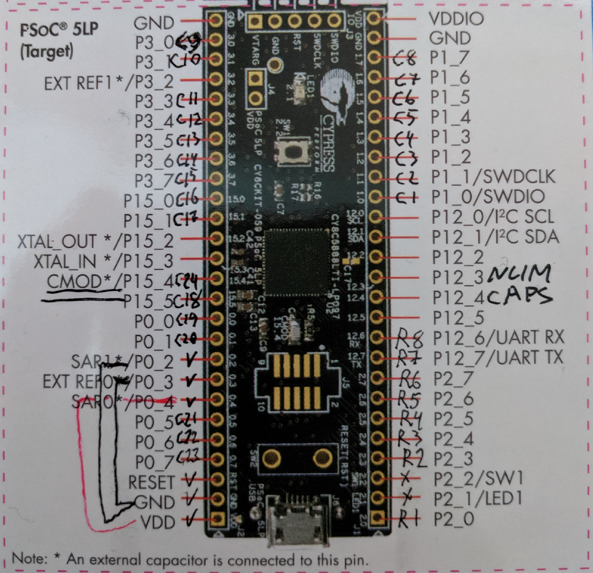

# CURIOSITY REQUIRED TO PROCEED
If you're not curious how this all works and "just want to convert your beamspring" - turn around now.

Nothing but sheer frustration lays on this path for you. This firmware/hardware is not for you, sorry about that.

Find someone how is curious about how things work or walked this path before and entice them to do it for you.

You have been warned.

# This software is provided "as-is".
There's neither a warranty of merchantability, nor warranty of fitness for any purpose.

## No warranties, expressed or implied.
You can fry the chip using this software. If you break it - you own *all* the parts.

If you cannot be relied on to understand written instructions - [here's one with pictures](https://deskthority.net/viewtopic.php?f=7&t=21899), courtesy snackthecat @DT.

If you can't understand it even with pictures - close this page and *never* return. I don't want to be responsible if you electrocute yourself with +5V from USB.

It is not my purpose to "promote adoption" of this software. This is a controller for **my** keyboard. I use it daily, you can use it too if you're smart enough how to do it on your own (but see "no warranties" above) - but that's about it.

If you want to add tap dance macros, or RGB LED support, or "port it to QMK" - by all means, the "Fork" button is right over there. GPLv3 applies, so you MUST make your derivative works available. But please do not ask me to do it, because I explicitly WILL NOT.

There are two exceptions to the above, but you know who you are, because I explicitly promised you.

# Planning: pinouts

* YOU MUST SET YOUR MATRIX SIZE to your physical matrix size. You can get away not doing it IF your switch is NORMALLY_LOW (flippers are by default in the air, Model F style). If it's not - you MUST do it.
* YOU MUST USE CONTIGUOUS ROWS/COLUMNS, STARTING FROM ZERO.
* Pins on the board are marked `0.0`, on envelope - `P0_0`, and in PSoC Creator - `P0[0]`. All 3 refer to the same pin. `2.3`-`2.7` means "2.3 to 2.7, including".
* Effort is made to make pins contiguous, but that's not always possible, so pay attention.

### If you're changing the pinout
* You'll need 35 pins. That's not much more than the kit has - so choose the layout wisely.
* rows are top(`Rows0[0]`) to bottom(`Rows0[7]`), columns are left(`Cols[0]`) to right(`Cols[23]`).
* Keep in mind that in FlightController everything is 1-based so normies can use it, so rows will be 1 to 8.
* P12(all pins of it) cannot be used for analog connections. That means you can only assign Rows to those pins.
* It is better to separate Rows and Cols by a pin electrically connected to the ground, but not necessary. If you use adjacent pins - one matrix cell will have higher readings, that's all.

### Default pinout: Project "8x24"
**WARNING** other projects use different pinouts!

**WARNING** to use column 24, **R5** (between `0.1` and `12.6`) MUST be removed.

If you don't - column will always read zeroes. Which is, for a NORMALLY_HIGH switch like Beamspring, means they will appear **PRESSED ALL THE TIME**.

* D0: `0.2`. Must be connected to the nearest `GND`.
* Guard: `0.3`. Must be connected to the nearest `GND`. Separate wire is **HIGHLY RECOMMENDED**
* ADC Vref: `0.4`. Must be connected to the nearest `VDD`.
* Rows: `2.0`, `2.3`-`2.7`, `12.7`, `12.6`
* Cols: `1.0`-`1.7`, `3.0`, `3.1`, `3.3`-`3.7`, `15.0`, `15.1`, `15.5`, `0.0`, `0.1`, `0.5`-`0.7`, `15.4`.

### ExpHdr (AKA "Solenoid connector")
Configured to blink the kit's LED on keypress. `12.4` is a CapsLock LED, `12.3` - NumLock.

**Leave it alone, unless you really know what you're doing. You can permanently damage GPIOs if you fuck up here.**

DO NOT POWER ANYTHING FROM GPIOs. Max GPIO source current is 4mA. FOUR. MILLIAMPERES.

So, `ExpHdr0`(`12.3` by default) would be "enable" line, and `ExpHdr2` (`2.1`) is the "fire" line. Delay settings are in "Hardware" section of FlightController. `ExpTgl` "USB scancode" toggles between normal operations and "all GPIOs are pulled to the ground".

# Soldering

I recommend flashing initial firmware plus some safe configuration first. It's just easier to plug the empty kit in - for initial flashing you'll have to plug the whole kit into standard USB socket, and that might be hard with a big hunk of metal attached to it.

### SOLDER THE KIT SO YOU CAN SEE THE CHIP.

It's in CAPS because I was stupid enough to solder it chip (and LED) facing backplate and blinking LED debugging without seeing the led is pain.

### Grounding considerations
Ground. Does. Not. Matter.

As long as you connected ALL the metal parts adjacent to PCB **and** PCB ground with ANY of the GND pins of the kit - you are fine. Stop worrying about it.

If your PCB doesn't have any vias - MAKE SURE YOU CONNECTED ALL GROUND TRACES ON BOTH SIDES OF THE PCB to controller ground. Floating traces are bad, mmkay.

Except if you see very unstable readings (matrix monitor over 15 seconds with no keypresses shows something like 1/50/255). Then you _probably_ have a ground quality issue.

When in doubt - use star ground. That is, connect all the things that must be grounded (basically, ALL THE THINGS except rows and columns) to a single point, using different wires.

# Flashing "default" firmware
This section is removed to stop causing stupid questions.
You MUST build. Deal with it.

# Building custom firmware
You'll need Windows machine. Mac with VirtualBox will do - but a couple of notes there.
You'll need to download [Virtualbox](https://www.virtualbox.org/wiki/Downloads) (v5.2.2 was used) - don't forget the extension pack - and a [windows image](https://developer.microsoft.com/en-us/microsoft-edge/tools/vms/) - I used "MSEdge on Win10". Download, unpack, click the .ovf, wait for import to complete. Then open settings (right-click, "Settings"), click "Ports", select "USB" tab, enable USB 2.0 controller, click the plug with blue dot. THIS WILL CONNECT ALL NEW USB DEVICES TO YOUR VM. Run the VM now. You have your windows development environment now. Download PSoC creator into VM, install (typical works just fine), and continue.
Linux with Virtualbox will probably work too - but not tested as I don't have any hardware running Linux and running virtualbox inside virtualbox is not something I plan to do anytime soon.

Download and install [PSoC Creator](http://www.cypress.com/products/psoc-creator-integrated-design-environment-ide) - you actually can download without suffering akamai download manager. Typical install works just fine. v4.2 was used, though newer should work too.

### Bootloader
You likely don't need to change bootloader - but building it will verify that your development environment is set up correctly.
* Open PSoC Creator
* File -> Open -> Project/Workspace, find "CommonSense.cywrk" and open it.
* Select "Project 'Bootloader'" in "Workspace Explorer" on the left, right-click, "Set as Active Project".
* **IMPORTANT:** Select "Release" in the combo box on the top toolbar that likely displays "Debug".
* Right-click again, "Device Selector", find and select "CY8C5888LTI-LP097". It's likely selected already.
* Press Shift-F6 to build bootloader.

#### Important troubleshooting notes
* "DTD prohibited for security reasons" means "you used ClownZip, and it couldn't decompress the .zip"
* "Unable to find component X" - right-click on top-left item in the left tree editor ("Workpace 'CommonSense' (7 Projects)"), click "Update Components". It should download the missing parts.
* Compilation errors: pay attention to the **IMPORTANT** warning. If it says "Release" - ask at DT, but see the top paragraph. You get support that you paid for (and you can't pay and there are no plans for that).

### Firmware
I will use "8x24" as a project name, but if you don't want to have merge conflicts in config.h every time you pull - you can copy+rename the project. You will only copy programmable hardware settings (which will not change - I run that for 1.5 years now and never had to) and config.h. Everything else will NOT be copied, so you will get all the updates.

Do a smoke test first: Repeat the "Bootloader" part for the 8x24 project.

When that succeeds - it's a good time to make your firmware customizations.

`CommonSense/8x24.cydsn/config.h` is a config file. You can set number of rows, columns and layers there, as well as switch type.
Again: **build without any changes first**!

For non-default pin mapping: Expand a project in the left pane, click "Pins" in "Design Wide Resources". You will see chip model and a table in the big window. Assign pins according to plan.

The Big Moment: plug the kit in. The "gold fingers" part goes into the USB socket.

Press "Ctrl-F5" (Debug -> Program). PSoC Programmer will likely demand to update KitProg - it will walk you thru. Refer to "Flashing "default" firmware" section for troubleshooting tips.

---
It's time now to disconnect the board, peel that polyimide film off the micro USB socket, find the micro-USB cable in the cable mess under your table, and plug it into "Target" part of the kit.

..I was able to plug _both_ ends into the same USB hub (thinkpad docking station) without frying anything - but your mileage may definitely vary.

You may optionally break the kitprog away in a symbolic gesture, but a) if I were you, I wouldn't - not until you set everything up successfully at least - and b) cut the laminate at the snap-off line first. Doesn't have to be all the way (though you certainly can if you're looking for excuse to dremel things), but enough so the board doesn't buckle so horribly and I2C/RS323 traces are not lifted from the substrate. Oh, and soldering probably have to wait until this moment at least.

# FlightController

The building process is [quite involved](Qt-build/README.md) - at least on Windows. OS X requires homebrew AND XCode, but is scriptable.

Luckly, in a fit of philantropy I have built versions for Windows and OS X in the [Releases](releases) section.

# Configure keyboard

With empty EEPROM, keyboard won't work. You need to initialize it. There are config files in misc/ directory, they are supposed to work, but no guarantees.

To load it into device, run FlightController, Config->Open, Config->Upload. BEWARE, thresholds may be set absolutely wrong! If they are - you will likely see red "UNSAFE" button in bottom right corner.

There are some reports that matrix size is weird after loading the config - restart FC or just hit that "Reconnect" button. It _should_ take care of that. But see the top of the file.

## Hardware configuration hints
* If you're using Linux and can't connect - run as root OR fix your device permissions. No, I don't find fucking with your udev enjoyable, thank you very much.
* If you see the red UNSAFE in the bottom right corner and what to know why - see "Debugging the matrix" below.
* If key monitor only shows zeroes, no matter which keys you press - set ADC resolution higher.
* If even at 12 bits it still doesn't work - increase charge delay. Recommended setting is 18.
* If you see double actuations on keypress - increase debouncing steps.
* If several keys fire at once - set longer discharge delay. I found that 180 (10 microseconds) works pretty well, but you can go even higher for increased EMI rejection.
* If you haven't touched ExpHdr pins - "Solenoid" mode and drive time set to 100 will make a LED on the kit blink with every keypress (not in setup mode). Smaller setting will decrease brightness.

## Configuring thresholds
**NOTE** for beamspring, invert direction, so max->min and adjustments are negative.

**!!!NOTE!!!** If you see double presses on some keys, set threshold higher - just under the steady pressed state. Some keys have physical bounce and there are two peaks. Controller is too fast and sees this as 2 keypresses.

Short version ():
* Click "Key Monitor" button. 
* Click "Start!". Get the idea of levels that should be there - press keys, observe readings going up and down. Small numbers below 7-segment indicators are min/avg/max.
* Click "Stop!". Select "Max" into dropdown near the "reset" button, click "Reset", "Start!". 
* Wait 15 seconds or longer, while readings stabilize.
* click "Stop!". Click "Set thresholds". Close window.
* Click "Thresholds" in the main window. put a small positive value (see below) into adjuster spinbox, click "Adjust".
* Click "Apply".
* Close threshold editor. Select "Config -> Upload" in menu. Test. Once you're satisfied with results, "Command -> Commit".

Thresholds should be set ~2x higher than most of the matrix settles on. For beamspring - probably 75% of the highest reading.
**TEST SETTINGS BEFORE COMMITTING**. If you get thresholds wrong - there will be a red "UNSAFE" light in the status bar and keyboard will refuse to produce output. It's supposed to retest settings after you upload. If it doesn't - click "Scan", it will try to restart scanning.

### Debugging the matrix
If something is wrong - you can still use matrix monitor using the following trick:
* open matrix monitor,
* make sure the mode is "Now"
* click "Start!"
* go to main window
* click "Scan"

The numbers under the "LCD" numbers are min/avg/max since last reset. Looking at those will tell you A LOT about what controller sees - but not everything, because in normal mode controller processes about 30 thousand rows per second and there is no way to transmit that amount of data over USB 2.0.

**WARNING** exit this mode in the reverse order (or by pulling out the USB plug), otherwise you'll likely have to reboot.

This is mostly useful for beamsprings - because all keys are down in beamspring by default. Model F is much easier - everything is up and you can just press a key to observe the effect. So, recommended debugging strategy - pull out the PCB, lay it down over grounded conductive surface, start matrix monitor, put one flipper (or a small coin) over the PCB and observe the changes. If several rows/columns change at the same time - you have a short between those, find it. If readings are normal but assembled keyboard is unstable - it's likely a ground problem.

## Configuring layouts
Pretty straightforward. If thresholds are configured, pressed keys will be highlighted by "yellow highlighter" color and focused on. If you have another keyboard - pressing a letter there will change combo box value to that letter, allowing for VERY quick layout generation.

"Layer mods" configures what Fn/LLck buttons do. Press F to ~~pay respects~~ scroll to those - several times. It will cycle thro all USB scancodes starting with "F".

"Import" and "Export" will load and save to file. Format is compatible with xwhatsit layout files.

IF you see keypresses in setup mode, but not in normal - check out global.h, #define NOT_A_KEYBOARD. If it's 1 - change back to zero.

## Macros and delays
Figure it out yourself, please. It's not that hard. Delays are the _library_ of delays which will be used in macros.
