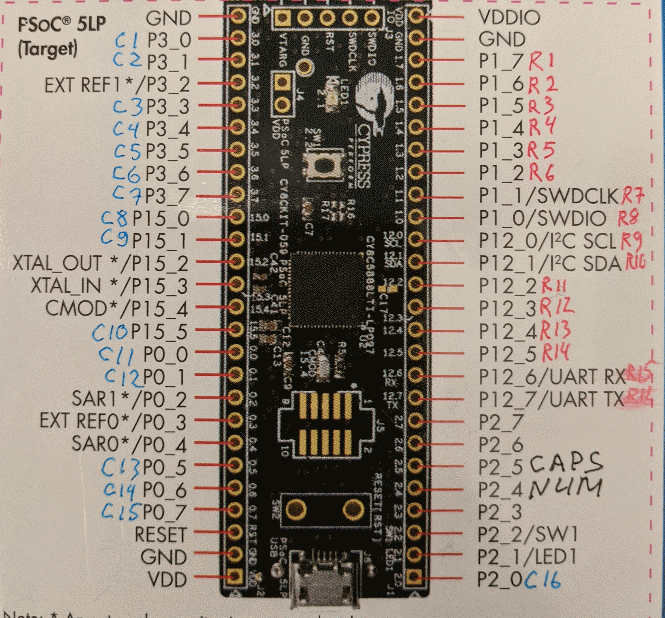

# Untested prototype firmware

Supposedly works with "microswitch" keyboards.

Scans at 200kHz, so should have plenty of time detecting those 60us pulses from pulse switches.

Please reuse pullup resistors from original keyboard - but if you can't and scan doesn't work with bare switches - go to TopDesign.cysch and change pins to resistive pullup and initial drive state to "High (1)". That should do the trick.

If you can get it working - let me know :D
